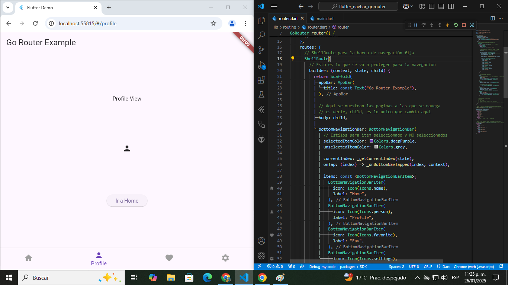

# 🚀 Flutter Learning Navbar GoRouter

[](https://flutter.dev)

[](LICENSE)



## 📚 Descripción

Este es un proyecto creado para aprender y experimentar con Flutter y la librería **GoRouter** para la navegación entre pantallas. Flutter es un framework de desarrollo móvil multiplataforma desarrollado por Google que permite crear aplicaciones nativas para iOS y Android con una sola base de código.

## 🎯 Objetivo del Proyecto

- Entender los conceptos básicos de Flutter.
- Experimentar con **GoRouter** para la navegación declarativa entre pantallas.
- Implementar una barra de navegación fija con **BottomNavigationBar**.
- Mejorar la experiencia de navegación añadiendo animaciones y transiciones.

## 🛠️ Características

- **GoRouter**: Configuración de rutas y navegación declarativa.
- **ShellRoute**: Implementación de rutas anidadas con un esquema de navegación fijo.
- **BottomNavigationBar**: Barra de navegación con íconos y selección visual.
- **NoTransitionPage**: Transiciones sin animación entre pantallas para un cambio más rápido.

## 📂 Estructura del Proyecto

```plaintext
lib/
├── main.dart           # Punto de entrada de la app y Pantallas de navegacion
├── routing/            # Configuración de rutas
```

## 🚀 Cómo Ejecutar el Proyecto

1. Asegúrate de tener Flutter instalado en tu sistema. Si no, sigue las instrucciones en la [documentación oficial](https://flutter.dev/)

2. Clona este repositorio:

```bash
git clone https://github.com/BastianNaitsab/flutter_navbar_gorouter
```

3. Navega al directorio:

```bash
cd flutter_navbar_gorouter
```

4. Instala las dependencias:

```bash
flutter pub get
```

5. Ejecuta la aplicación:

```bash
flutter run
```

## 🧰 Herramientas Usadas

- **Flutter SDK:** Framework
- **Dart:** Lenguaje de Programacion
- **VS Code:** Entorno de Desarrollo
- **Android Studio:** Emulador
- **GoRouter**: Librería para la navegación declarativa

## 📖 Lo que He Aprendido

- 🌟 Implementación de rutas con **GoRouter** y **ShellRoute** para navegar entre pantallas.
- 🌟 Uso de **BottomNavigationBar** para navegación fija con transiciones personalizadas.
- 🌟 Manejo de **NoTransitionPage** para evitar animaciones predeterminadas en la navegación.
- 🌟 Implementación de un sistema de navegación reactivo con **GoRouterState**.

## 📋 Próximos Pasos

- Añadir autenticación y rutas protegidas.
- Mejorar la UI/UX, haciendo que la barra de navegación sea más interactiva.

## 🤝 Contribuciones

Este proyecto es principalmente para aprendizaje personal, pero siéntete libre de proponer mejoras o sugerencias.

## 📞 Contacto
Bastian Naitsab - [devmentesacontacto@gmail.com](mailto:devmentesacontacto@gmail.com)  
GitHub: [BastianNaitsab](https://github.com/BastianNaitsab)